# CarInsight Pro — AI-Powered Car Price Prediction & Advisory Platform

A full-stack web application that helps buyers and sellers make informed decisions on used cars — predicting fair market price, estimating resale value over time, recommending cars within a budget, and running EMI/finance affordability checks. Built on a machine-learning pipeline trained on 11,000+ real used-car listings.

Built with **FastAPI, MySQL/SQLAlchemy** on the backend, **React (Create React App) + Recharts** on the frontend, and a **scikit-learn / XGBoost / LightGBM** model-comparison pipeline for price prediction.

---

## Table of Contents

- [Overview](#overview)
- [Key Features](#key-features)
- [Tech Stack](#tech-stack)
- [System Architecture](#system-architecture)
- [Model Performance](#model-performance)
- [Screenshots](#screenshots)
- [Project Structure](#project-structure)
- [Getting Started](#getting-started)
- [Usage Guide](#usage-guide)
- [API Reference](#api-reference)
- [Limitations](#limitations)
- [Future Scope](#future-scope)
- [Author](#author)

---

## Overview

Buying or selling a used car usually means guessing at fair value from a handful of classified listings. **CarInsight Pro** replaces that guesswork with a data-driven pipeline:

1. A dataset of 11,000+ used-car listings (brand, model, year, km driven, fuel, transmission, ownership history) is cleaned and feature-engineered.
2. Five regression models (Linear Regression, Random Forest, Gradient Boosting, XGBoost, LightGBM) are trained and cross-validated; the best performer is auto-selected and shipped to the API.
3. Users sign up (with email OTP verification), log in, and get a personalized dashboard to predict prices, estimate resale value, get car recommendations within budget, and check loan affordability.
4. Admins get a separate console to manage users, monitor stats, and reset/clear data.

## Key Features

- **Price Prediction** — predicts a fair market price for a car from brand, model, year, km driven, fuel type, transmission, ownership, and seller type, with a confidence score.
- **Resale Value Estimator** — projects a car's future resale value based on purchase price, age, mileage, and fuel type, with a depreciation breakdown.
- **Smart Recommendations** — suggests cars that fit a budget, purpose (family/commute/etc.), seat count, and fuel preference, ranked by a match score.
- **Finance/EMI Calculator** — checks loan affordability and computes EMI breakdowns against income and existing obligations.
- **Model Diagnostics Dashboard** — visual comparison of all five trained models (R², MAE, RMSE, learning curves, confusion matrices, feature importance) served straight from the training reports.
- **Wishlist & History** — save cars of interest and review past predictions/recommendations.
- **Authentication** — signup with email OTP verification, JWT-based login, forgot/reset password, login lockout after repeated failures.
- **Admin Console** — user management, usage stats, password resets, and per-user/global data clearing.
- **Light/Dark theme** persisted across sessions.

## Tech Stack

| Layer | Technology |
|---|---|
| Backend | Python, FastAPI, Uvicorn |
| Database | MySQL via SQLAlchemy ORM |
| Auth | JWT (python-jose), bcrypt password hashing, email OTP |
| Machine Learning | scikit-learn, XGBoost, LightGBM, pandas, NumPy, joblib |
| Frontend | React 19, React Router, Recharts, Axios, lucide-react |
| Reporting | Matplotlib-generated diagnostic plots served via API |

Full dependency lists: [`requirements_backend.txt`](./requirements_backend.txt) · [`requirements_ml.txt`](./requirements_ml.txt) · [`frontend/package.json`](./frontend/package.json)

## System Architecture

```
                    ┌───────────────────────┐
  used-car listings │  data/final_dataset.csv│
                    └───────────┬───────────┘
                                │
                                ▼
                    ┌───────────────────────┐
                    │  ml/ pipeline          │
                    │  preprocessing →       │
                    │  train 5 models →      │
                    │  pick best (metadata)  │
                    └───────────┬───────────┘
                                │ best_model.pkl, scaler.pkl, encoders
                                ▼
┌────────────┐      ┌───────────────────────┐      ┌───────────────────┐
│  React SPA │◀────▶│  FastAPI backend       │◀────▶│  MySQL database    │
│ (frontend) │ REST │  auth / predict /      │      │  users, predictions │
└────────────┘      │  recommend / finance / │      │  wishlists, logs    │
                    │  diagnostics / admin   │      └───────────────────┘
                    └───────────────────────┘
```

**Backend modules**
- `backend/routes/auth_routes.py` — signup (OTP), login, forgot/reset password.
- `backend/routes/predict_routes.py` — price prediction, resale valuation.
- `backend/routes/other_routes.py` — recommendations, finance, dashboard, wishlist, history.
- `backend/routes/diagnostics_routes.py` — model metrics & diagnostic plot images.
- `backend/routes/admin_routes.py` — admin stats, user management, data clearing.
- `ml/` — data preprocessing, model training/evaluation, price predictor, resale valuation logic.

## Model Performance

Five models were trained and cross-validated on the used-car dataset; **Gradient Boosting** was auto-selected as the production model:

| Model | R² | MAE (₹) | RMSE (₹) | Tier Accuracy |
|---|---|---|---|---|
| **Gradient Boosting** ⭐ | **0.939** | **174,556** | **336,437** | **85.3%** |
| XGBoost | 0.939 | 175,668 | 337,492 | 85.5% |
| Random Forest | 0.933 | 180,203 | 353,042 | 83.9% |
| LightGBM | 0.933 | 186,389 | 353,884 | 84.3% |
| Linear Regression | 0.813 | 341,928 | 589,864 | 68.6% |

Full per-model diagnostics (learning curves, predicted-vs-actual plots, confusion matrices, feature importance) are generated by [`ml/model_training.py`](./ml/model_training.py) into [`reports/`](./reports) and served live from the **Diagnostics** page in the app.

## Screenshots

| Sign Up | Email Verification |
|---|---|
|  | 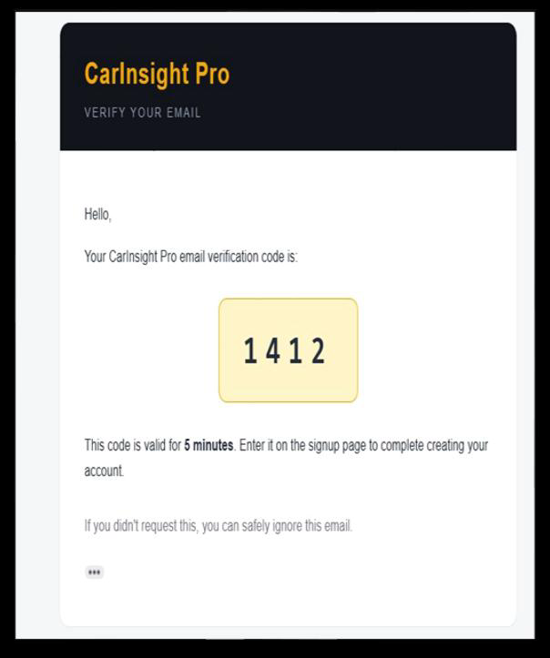 |

| Login | Dashboard |
|---|---|
| 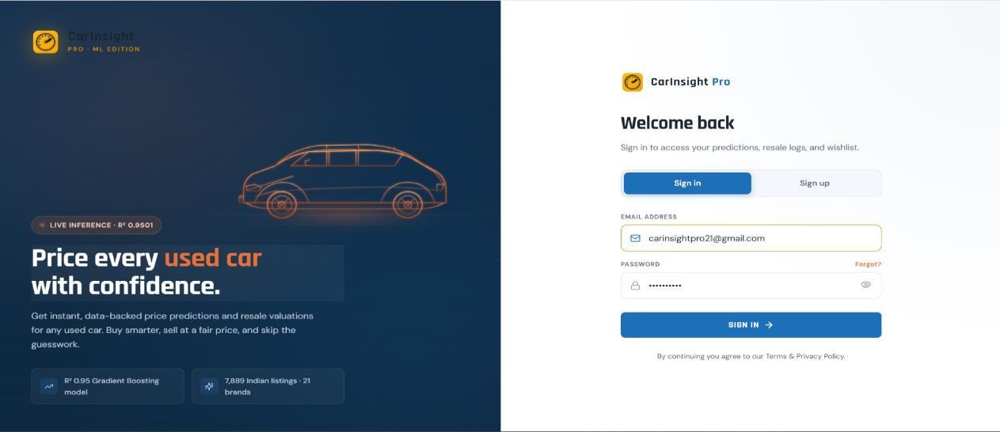 | 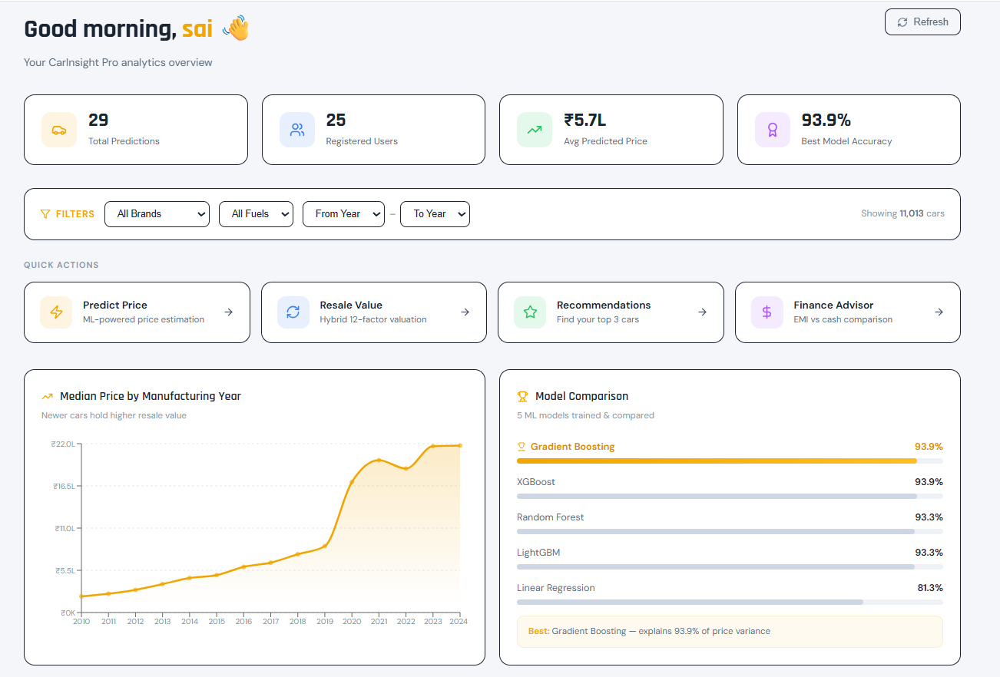 |

| Dashboard Analytics | Predict Car Price |
|---|---|
| 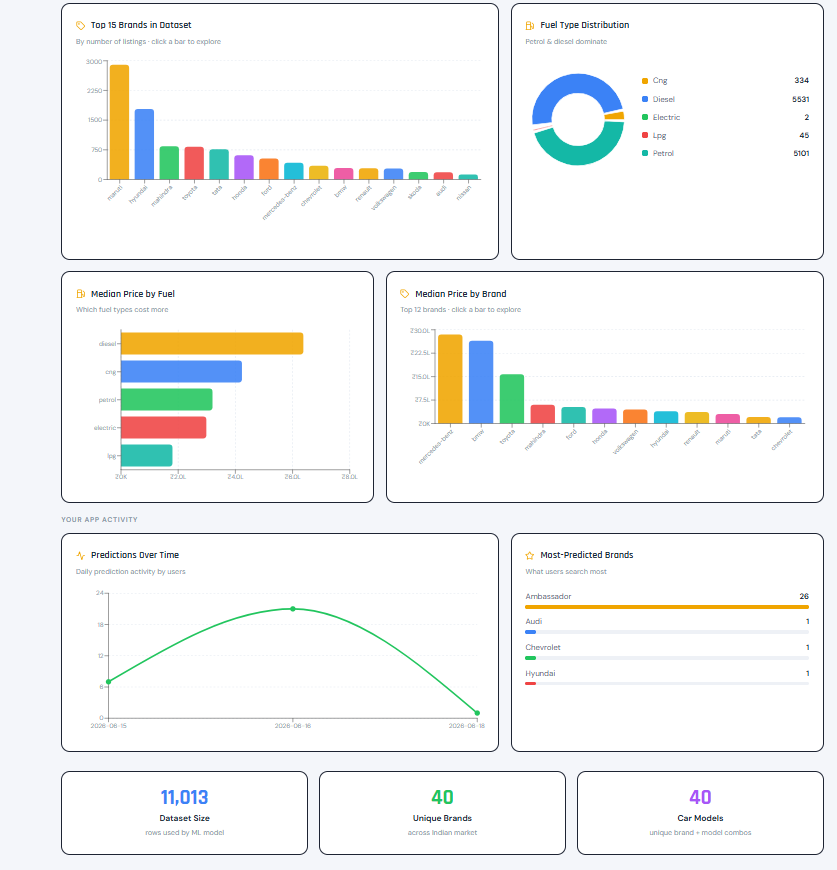 | 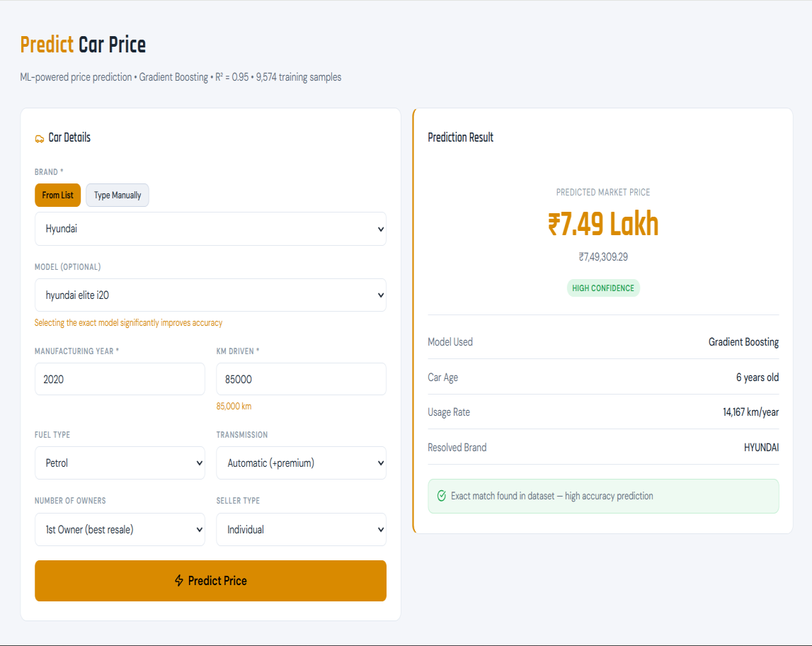 |

| Resale Valuation | Recommendations — set preferences |
|---|---|
| 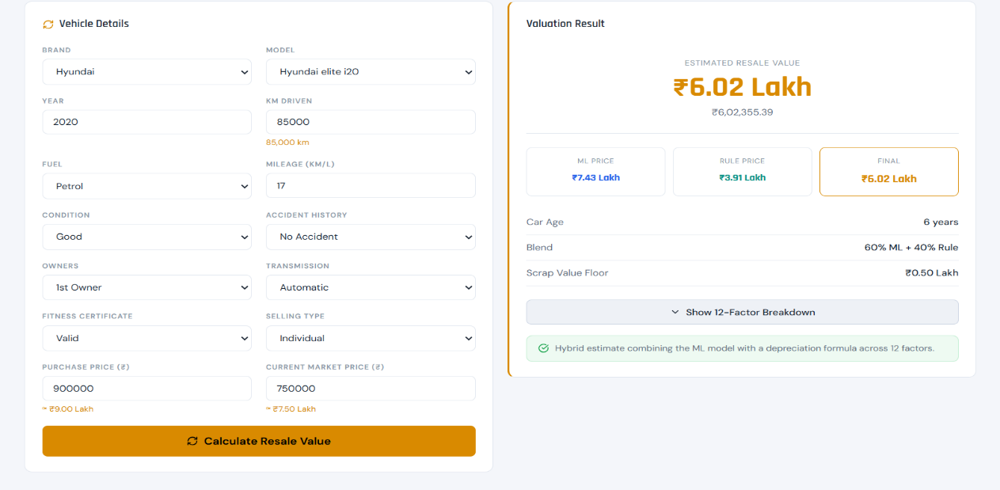 | 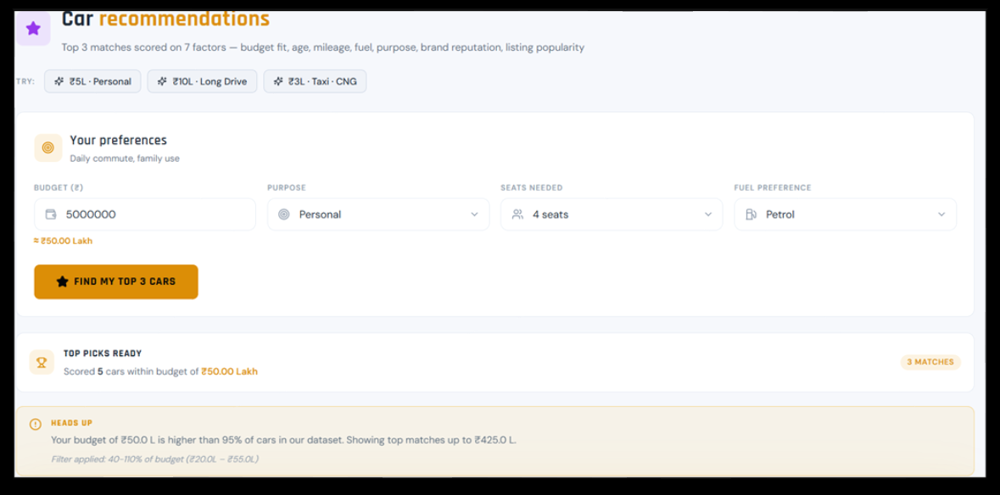 |

| Recommendations — results | Finance vs Cash |
|---|---|
| 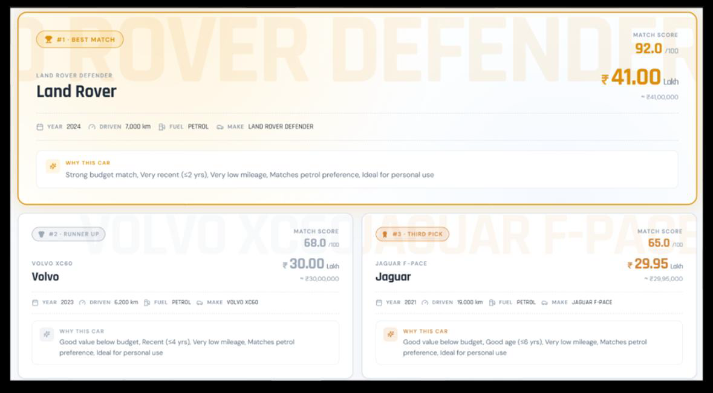 | 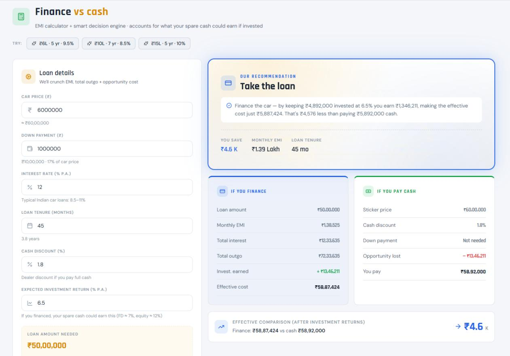 |

| Prediction History | Wishlist |
|---|---|
| 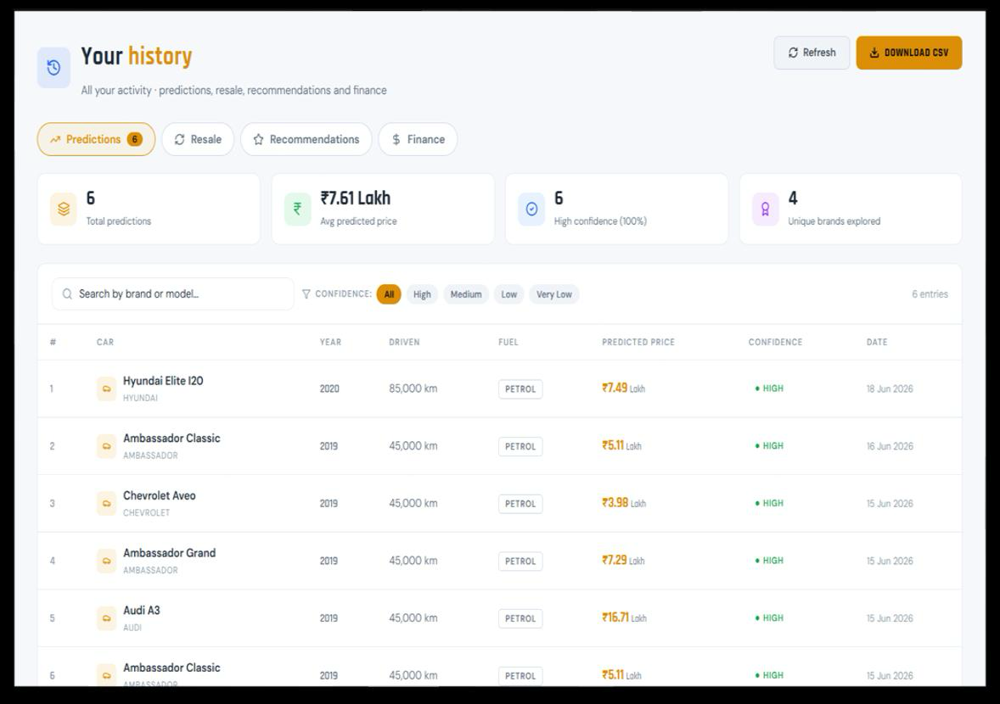 | 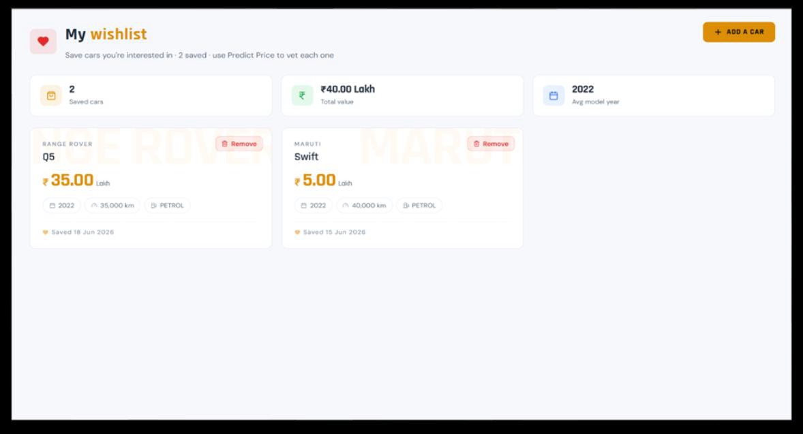 |

| Model Diagnostics | Admin Panel |
|---|---|
| 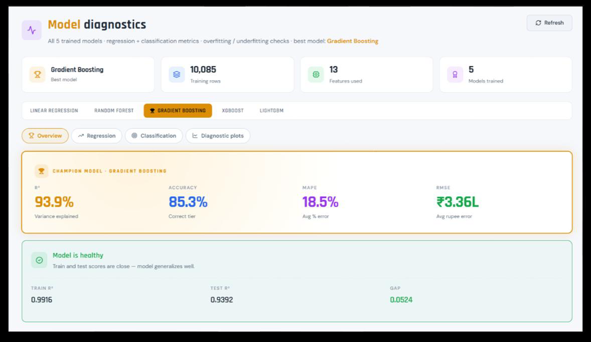 | 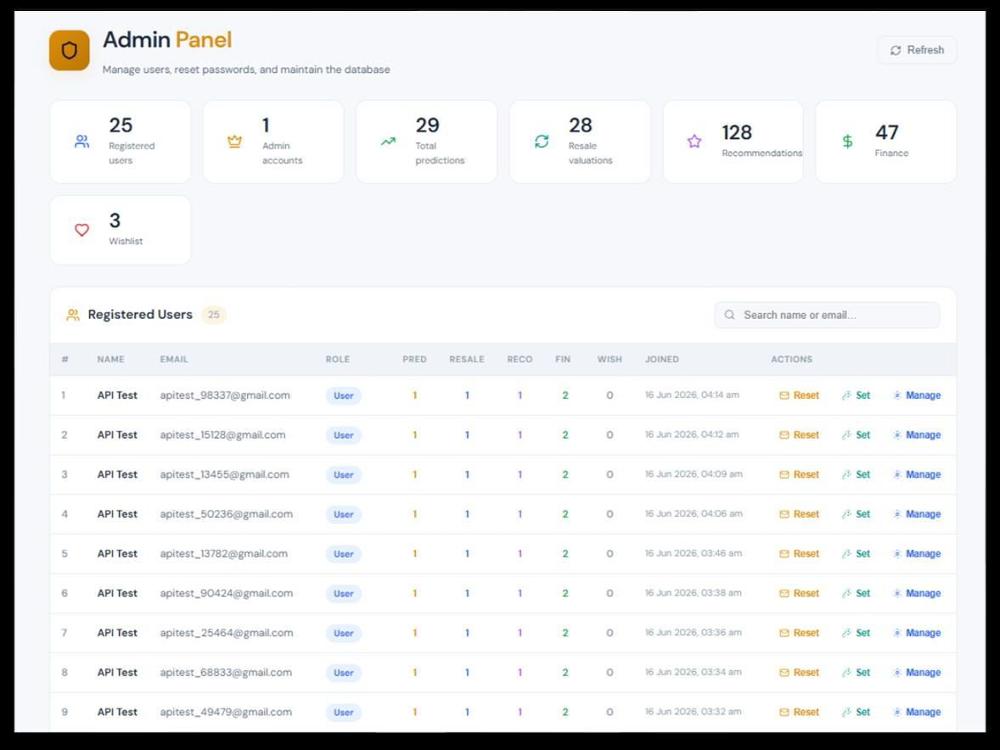 |

Every screen supports both a light (day) and dark (night) theme.

**Model diagnostics (from `reports/`):**

| Model Comparison | Feature Importance |
|---|---|
| 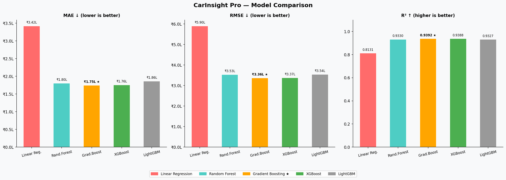 | 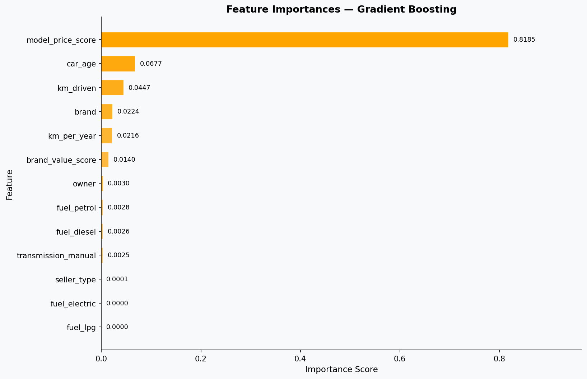 |

| Predicted vs Actual (Gradient Boosting) | Learning Curve (Gradient Boosting) |
|---|---|
| 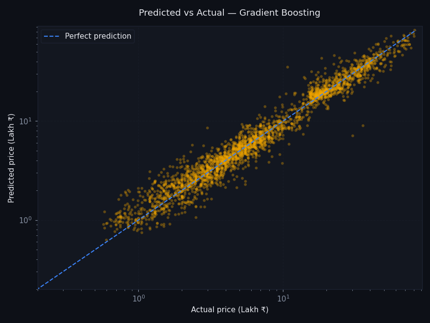 | 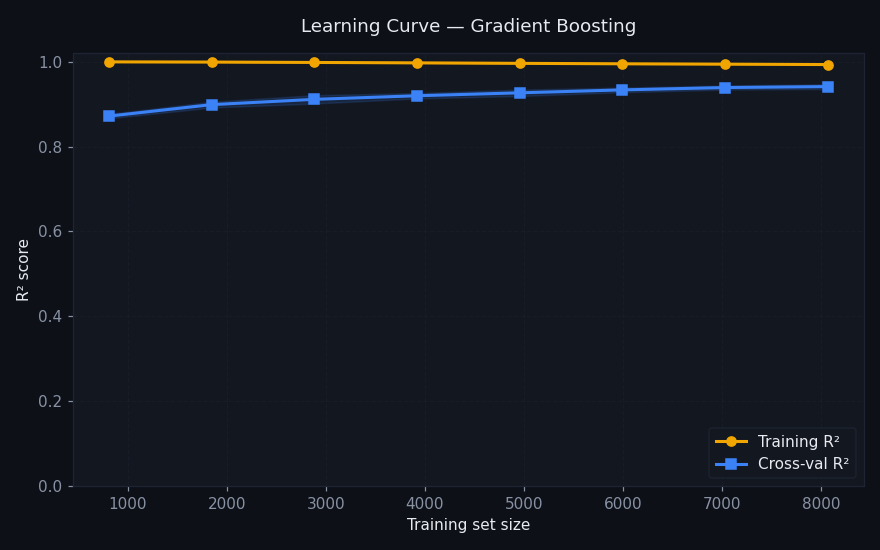 |

## Project Structure

```
carinsight-pro/
├── backend/                     # FastAPI application
│   ├── routes/                  # auth, predict, other (recommend/finance/wishlist), diagnostics, admin
│   ├── main.py                  # app entry point, router registration, DB startup seeding
│   ├── models.py                # SQLAlchemy ORM models
│   ├── schemas.py                # Pydantic request/response schemas
│   ├── auth.py                  # password hashing, JWT creation/validation
│   ├── database.py               # DB engine/session config
│   └── email_utils.py            # OTP & notification emails
├── ml/                           # Training pipeline & inference logic
│   ├── data_preprocessing.py
│   ├── model_training.py
│   ├── evaluation.py
│   ├── predictor.py               # loads best_model.pkl for live predictions
│   └── valuation.py               # resale-value calculation
├── models/                       # Trained artifacts (best_model.pkl, scaler, encoders, metadata.json)
├── data/                         # Source & processed used-car datasets
├── reports/                      # Model comparison charts, learning curves, diagnostics.json
├── frontend/                     # React SPA
│   └── src/
│       ├── pages/                # Dashboard, PredictPrice, ResaleValue, Recommend, Finance, Wishlist, History, Diagnostics, Admin, Login
│       ├── components/            # Sidebar, ProtectedRoute, Skeleton
│       └── api/axios.js           # API client
├── requirements_backend.txt
├── requirements_ml.txt
└── test_api.py                   # API smoke tests
```

## Getting Started

### Prerequisites

- Python 3.10+
- Node.js 18+ and npm
- MySQL server running locally
- (Windows) PowerShell execution policy set to allow venv activation

### Installation

```bash
# 1. Clone the repository
git clone https://github.com/SAi-021/carinsight-pro.git
cd carinsight-pro

# 2. Create and activate a virtual environment
python -m venv venv
# Windows (PowerShell):
Set-ExecutionPolicy -Scope Process -ExecutionPolicy RemoteSigned
.\venv\Scripts\Activate.ps1
# macOS/Linux:
source venv/bin/activate

# 3. Install backend + ML dependencies
pip install -r requirements_backend.txt
pip install -r requirements_ml.txt

# 4. Configure the database
# Update the DB connection string/password in backend/database.py
# Make sure MySQL is running (Windows: net start MySQL80)

# 5. (Optional) Retrain the ML models
python ml/run_training.py
# Trains all 5 models on data/final_dataset.csv, writes best_model.pkl
# to models/ and diagnostic plots to reports/

# 6. Run the backend
cd backend
python -m uvicorn main:app --reload --port 8000
# API docs at http://localhost:8000/docs

# 7. Run the frontend (in a new terminal)
cd frontend
npm install
npm start
```

Visit **http://localhost:3000** in your browser. On first run, `main.py`'s startup hook creates the database tables and seeds `model_metrics` from `models/metadata.json`.

## Usage Guide

1. **Sign up** — enter name, email, and password; verify via the OTP emailed to you.
2. **Log in** to reach the dashboard.
3. **Predict Price** — enter brand, model, year, km driven, fuel, transmission, ownership, and seller type to get an instant price estimate with a confidence score.
4. **Resale Value** — enter purchase price, current price, age, and mileage to see projected resale value and depreciation breakdown.
5. **Recommend** — set a budget, purpose, seat count, and fuel preference to get ranked car suggestions.
6. **Finance** — check EMI affordability against income and existing obligations.
7. **Diagnostics** — compare all five trained models' accuracy, error metrics, and plots.
8. **Wishlist / History** — save cars of interest and review past predictions and recommendations.
9. **Admin** (admin accounts only) — view usage stats, manage users, reset passwords, or clear data.

## API Reference

Interactive API docs (Swagger UI) are auto-generated by FastAPI and available at `http://localhost:8000/docs` once the backend is running. Key route groups:

| Prefix | Purpose |
|---|---|
| `/auth` | signup, OTP verification, login, forgot/reset password |
| `/predict-price`, `/resale-value` | ML-backed price & resale predictions |
| (other) | recommendations, finance/EMI, dashboard, wishlist, history |
| `/diagnostics` | model metrics JSON & diagnostic plot images |
| `/admin` | user stats, management, password reset, data clearing |

## Limitations

- Predictions are only as good as the training dataset (11,014 listings); rare brand/model combinations fall back to broader brand-tier estimates.
- OTP and login-lockout state are stored in memory (module-level dicts) — fine for a demo, but resets on server restart and won't scale across multiple backend instances.
- Seven-seater detection is inferred from model-name keywords rather than a dedicated dataset field.
- No liveness/image-based verification — data is entered manually, not scraped from live listings.

## Future Scope

- Move OTP/lockout state to Redis for multi-instance deployments.
- Incremental retraining as new listings are added, instead of a full retrain.
- Live market-data integration (scraping or a listings API) to keep predictions current.
- Deploy behind HTTPS with a managed MySQL instance and CI/CD pipeline.
- Mobile-friendly / PWA frontend.

## Author

**S Sai Krishna**
📧 sai2002siva@gmail.com · 🔗 [LinkedIn](https://www.linkedin.com/in/s-sai-krishna21)

---

*If you find this project useful, consider giving it a ⭐ on GitHub!*
